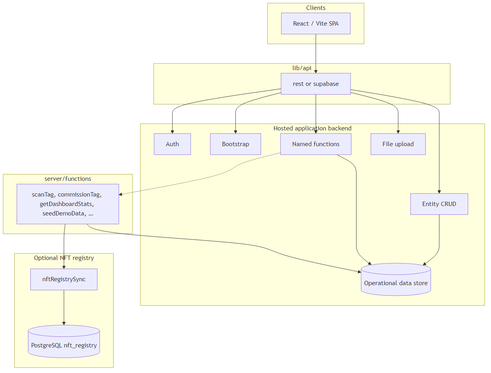
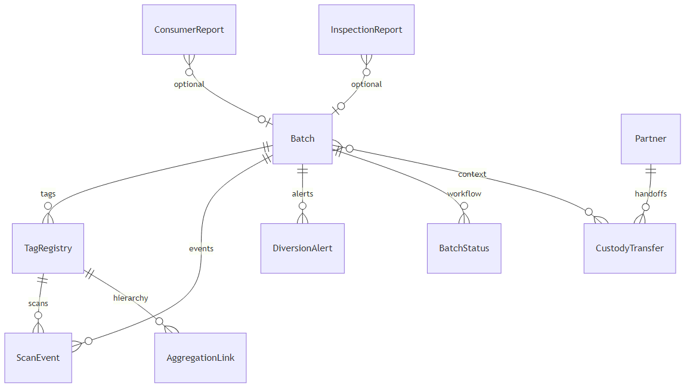
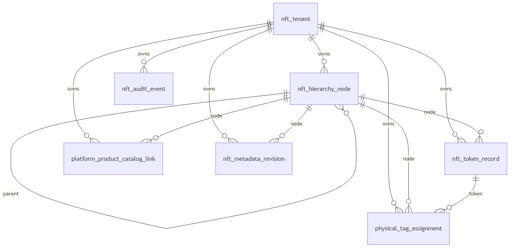
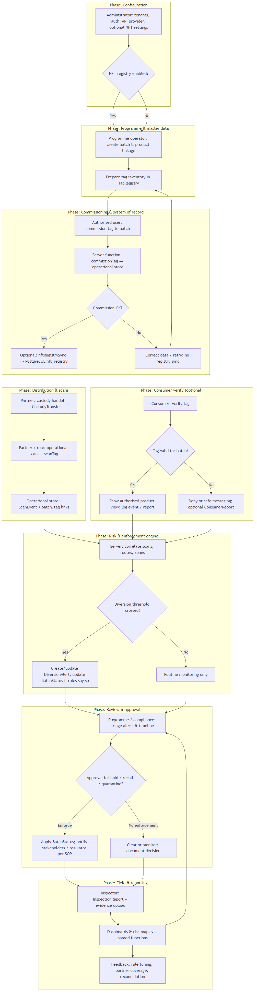

# TraceGuard — Architecture & operations report

This document combines the **architecture narrative**, **technical diagrams**, and **end-to-end business flow** for stakeholders, implementation partners, and security reviewers. Generated from repository sources in `docs/`.

**Diagram sources:** `docs/diagrams/*.mmd` · **Narrative source:** `docs/ARCHITECTURE_NARRATIVE.md`

---

## 1. Product context

TraceGuard supports **authenticate → trace → enforce** for regulated physical goods: serialised NFC tags, scan events across the supply chain, diversion intelligence, inspector workflows, and optional linkage to an **NFT-oriented tag registry** in PostgreSQL. The repository ships a **single-page web application** and **reference server logic**; your **hosted backend** owns authentication, persistence, and API routing unless you adopt Supabase end-to-end.

---

## 2. Layered system architecture

The first diagram (`docs/diagrams/01-architecture.mmd`) shows a deliberate split between **what runs in the browser**, **how the app talks to infrastructure**, and **where state actually lives**.

### 2.1 Client: React / Vite SPA

The UI is a modern React application built with Vite. It loads only public configuration and user-visible data through controlled APIs. It does not embed database drivers or service-role secrets; that boundary keeps the attack surface small and aligns with typical compliance expectations for front-end code.

### 2.2 Integration adapter: `lib/api`

All backend access is funnelled through **`lib/api`**, which switches on **`VITE_API_PROVIDER`**:

- **REST** — The app uses `fetch` against your API origin, sending a bearer token from storage for authenticated calls. This supports custom gateways, existing enterprise APIs, or a thin BFF you operate yourself.
- **Supabase** — The same abstractions map to Supabase Auth, PostgREST-style entity access, Storage, and Edge Function invocation.

That dual-provider pattern is a **portability** choice: the product narrative (traceability, enforcement, inspector tools) stays stable while you swap the concrete host (custom REST vs managed Postgres + functions). Details of paths and payloads are specified in [`BACKEND_API.md`](BACKEND_API.md).

### 2.3 Hosted application backend

Regardless of provider, the logical backend exposes:

- **Auth** — Session or JWT validation and a `me`-style profile (including optional `role` for admin-only flows).
- **Bootstrap** — Lightweight public app metadata so the shell can start before deep data loads.
- **Entity CRUD** — Create, read, and update for tables that back forms and queues (for example inspection reports, consumer reports, batch status, contact leads), with naming aligned to `lib/api/entityTableMap.js` when using the REST table contract.
- **Named functions** — Coarse-grained operations the UI invokes by name (`scanTag`, `commissionTag`, `getDashboardStats`, `inspectorAI`, and others). These encapsulate joins, aggregations, AI tool use, and **elevated read patterns** where row-level security would otherwise return empty lists to the browser.
- **File upload** — Binary uploads for evidence photos and similar artifacts, returning durable URLs for persistence on entity rows.

Underneath these APIs sits the **operational data store**: the database or tables that hold batches, tags, scans, alerts, partners, and the rest of the domain. That store is **authoritative for live operations**—especially **scan throughput** and **enforcement state**.

### 2.4 Server functions (reference and deployment target)

The `server/functions/` tree holds **TypeScript handlers** that embody business rules: scanning logic, commissioning, dashboard statistics, demo seeding, optional AI assistants, and **NFT registry synchronisation**. In deployment, these may run as Supabase Edge Functions, a Node service, or workers behind your API gateway—the diagram shows them writing to the **same operational store** the UI ultimately observes.

The dashed line from **named functions** to **server/functions** indicates that **your** REST or Edge deployment **wires** those routes to this logic (or a reimplementation). The repository treats this code as the **authoritative reference** for behaviour, not as an opaque black box.

### 2.5 Optional NFT registry (PostgreSQL)

Operational NFC and event data remain in the main entity store. A **separate PostgreSQL schema** (`nft_registry`, defined in `database/nft-registry/postgres/001_schema.sql`) holds **taxonomy, hierarchy, token lifecycle, metadata revisions, and physical-tag inventory** suitable for enterprise structure and optional on-chain alignment.

Synchronisation (`nftRegistrySync` and related call sites) runs **after** successful operational writes where configured (for example commissioning). That order makes the **ops store canonical for “what happened in the field”**, while the NFT database can be authoritative for **catalogue structure, mint state, and compliance-oriented metadata history** without contending with high-volume scan ingestion. Environment variables for the registry connection are **server-side only**; see [`DATABASE.md`](DATABASE.md).

---

## 3. Operational domain model (conceptual)

The second diagram (`docs/diagrams/02-operational-domain.mmd`) is a **conceptual entity-relationship view** of the domain described in [`DATABASE.md`](DATABASE.md). Your hosted backend must implement storage that satisfies these relationships; exact column names and foreign keys are part of your schema design.

- **Batch** is the anchor for regulated product lots: diversion scoring, zones, and enforcement posture typically roll up here.
- **TagRegistry** binds **physical NFC identities** to batches (and product identifiers as you model them).
- **ScanEvent** records **what was scanned, where, and when**—commissioning, port, wholesale, retail, consumer verification, returns, seizure, and similar touchpoints. Events tie back to tags and batches for timelines and analytics.
- **DiversionAlert** and **BatchStatus** support **regulator-facing** risk signals and **workflow** states (holds, recalls, quarantine).
- **AggregationLink** expresses **parent/child tag hierarchy** (case, pallet, item) where your programme uses aggregated packaging.
- **Partner** and **CustodyTransfer** model **handoffs** between supply-chain actors.
- **ConsumerReport** and **InspectionReport** capture **downstream** and **field** intelligence; they may reference batches or tags depending on your forms.
- **ContactLead** is intentionally lightweight: marketing or support intake, not core traceability.

Some dashboards and maps load aggregated data through **server functions** using a **service role** (or equivalent) so that **entity-level read rules** in the browser do not silently empty charts for legitimate signed-in users. That pattern is documented alongside **`getRiskMapData`** and **`listConsumerReports`** in [`DATABASE.md`](DATABASE.md).

---

## 4. NFT registry data model

The third diagram (`docs/diagrams/03-nft-registry.mmd`) matches the PostgreSQL schema: a **tenant-scoped tree** of hierarchy nodes, optional **on-chain token records**, **physical tag assignments** keyed by `tag_uid`, **product-to-node catalog links**, **versioned metadata revisions** (for “what the consumer saw at time T”), and an **append-style audit trail**.

**Bridge fields** tie this world to operations: **`physical_tag_assignment.tag_uid`** aligns with **`TagRegistry.tag_uid`**; **platform product identifiers** align with your SKU or product keys in the ops layer. Integration can be **event-driven** (commission → sync message) or **batch reconciliation**; strict failure modes are governed by **`NFT_REGISTRY_SYNC_STRICT`** as described in [`DATABASE.md`](DATABASE.md).

---

## 5. End-to-end business flow (operations)

The following diagram summarises the **business process** from configuration and master data through commissioning, supply-chain scans, consumer verification, risk signals, compliance review, inspections, and reporting. It complements the technical architecture above for product, operations, and executive audiences.

---

## 6. Design principles (summary)

1. **Thin client, thick contracts** — The browser speaks only HTTP-level APIs; complex rules and privileged reads live server-side.
2. **Operational store first** — Scans and enforcement state remain in the primary backend; optional NFT data extends—not replaces—that truth.
3. **Provider portability** — `rest` vs `supabase` lets you align procurement and existing infrastructure without rewriting the product UI.
4. **Explicit sync boundary** — The NFT registry is a **separate database** so taxonomy, legal metadata, and token lifecycle can evolve on their own cadence and scaling profile.
5. **Secrets stay off the bundle** — Registry URLs, service keys, and AI credentials belong in **server function** or **backend** configuration only.

Together, the diagrams and this narrative describe **one coherent architecture**: a traceability front end, a pluggable API surface, an operational system of record, optional reference server logic, and an optional PostgreSQL NFT catalogue linked by clear bridge fields and sync hooks.
