# Truetrace NFT: Secure Traceability for Regulated Supply Chains

**Strategic business and architecture report**  
**Audience:** Regulators, pharmaceutical manufacturers, FMCG enterprises, investors, and supply chain partners  
**Classification:** External / stakeholder engagement  
**Version:** 1.0 · **Date:** April 2026

---

## 1. Executive Summary

### 1.1 Overview

**Truetrace NFT** is a secure **digital identity and end-to-end traceability platform** for regulated physical goods. Each product—or aggregated packaging level—carries a **cryptographically strong, NFC-first identity** (built around industry-grade secure tags such as **NXP NTAG 424 DNA**), supported by **hybrid verification** (NFC tap, QR fallback, and **SMS/USSD** for low-connectivity contexts). The platform records **supply-chain events** in a manner aligned with **GS1 EPCIS** principles, surfaces **regulator and enterprise dashboards**, and can maintain **NFT-oriented digital twins** (catalogue structure, token lifecycle, and versioned metadata) with optional alignment to distributed ledger technologies where policy and infrastructure permit.

Truetrace operationalises a closed loop: **authenticate → trace → enforce**. That loop transforms authentication from a one-off consumer check into a **system of record** for custody, diversion risk, recalls, and compliance collaboration.

### 1.2 The problem: counterfeits, diversion, and trust deficits

**Substandard and falsified (SF) medical products** and **illicit trade in consumer goods** impose human harm, erode brand equity, distort markets, and complicate regulatory oversight. The World Health Organization and peer institutions emphasise that SF products are a **global** challenge, with elevated incidence signals in many low- and middle-income markets where informal distribution, weak cold-chain assurance, and uneven enforcement intersect. The economic and reputational damage extends to insurers, logistics providers, and governments that must fund emergency care, investigations, and border controls when unsafe goods enter circulation.

Beyond outright fakes, **diversion** (unauthorised channel movement, grey-market resale, and tampered repackaging) undermines serialization programmes that stop at “genuine at first sale.” Enterprises require **continuous trace evidence**, not only a static authenticity answer at the pharmacy counter. Diversion also complicates **pharmacovigilance**: adverse events tied to mishandled or repackaged stock may be misattributed to legitimate manufacturers. For FMCG and premium brands, parallel imports and look-alike packaging destroy price architecture and consumer confidence even when the diverted product is technically “authentic” but unsuitable for the destination market (warranty, language, formulation, or shelf-life rules).

**Trust deficits** are not abstract. When verification is cumbersome or opaque, consumers revert to heuristics—seller reputation, price, packaging feel—which sophisticated counterfeiters mimic. Truetrace addresses both **technical assurance** (harder-to-clone identities) and **experience design** (fast, intelligible outcomes) so that trust becomes operational rather than sentimental.

### 1.3 Value proposition and expected impact

| Dimension | Outcome |
|-----------|---------|
| **Brand and patient safety** | Strong binding between physical item and digital record; reduced successful cloning versus static codes. |
| **Supply chain integrity** | Event capture at handoffs; aggregation/de-aggregation visibility; hotspot and route analytics. |
| **Regulatory collaboration** | Shared evidence bases, anomaly dashboards, recall/quarantine workflows, audit trails. |
| **Commercial resilience** | Differentiation for premium FMCG; channel compliance; insurance of distribution investments. |

Expected impact scales with **programme coverage** (tagged SKUs, partner scan discipline, and regulator adoption). Pilots typically yield rapid **signal value** (verification geography, repeat scans, suspicious patterns) even before national scale.

### 1.4 Why now

**Regulatory maturation:** Jurisdictions are moving from **consumer authentication** alone toward **traceability, data exchange, and risk-based supervision**. Nigeria’s **NAFDAC Mobile Authentication Service (MAS)** established mass-market familiarity with **phone-based verification**; the next wave combines that accessibility with **strong cryptography, item-level identity, and event histories**.

**Technology readiness:** Secure NFC, cloud-native event processing, and standards-based identifiers (GS1 GTIN, SSCC, SGTIN) make **enterprise-grade programmes** implementable without bespoke hardware at every node.

**Market pressure:** E-commerce growth, trans-shipment complexity, and public expectation of **instant verification** increase the cost of legacy approaches (easily copied labels, non-unique QR prints, siloed databases).

**Capital markets:** Investors favour **infrastructure plays** with recurring SaaS, data services, and defensible integration into compliance regimes.

---

## 2. Business Overview

### 2.1 Solution description

Truetrace is best understood as three coupled capabilities:

1. **Secure physical identity** — NTAG 424 DNA–class tags provide **SUN (Secure Unique NFC) message** behaviour and cryptographic protections that raise the bar for tag cloning versus printed codes alone.
2. **Operational trace graph** — Each scan and custody transfer appends to an **event ledger** (business ledger, not necessarily public blockchain) with batch/serial linkage and optional **parent–child aggregation**.
3. **Digital twin / NFT registry** — A structured registry models **hierarchy, token lifecycle, metadata revisions, and physical-tag inventory**, enabling enterprise governance and optional on-chain anchoring.

### 2.2 Hybrid verification model

| Channel | Role |
|---------|------|
| **NFC tap** | Primary, low-friction, cryptographically strong verification on capable smartphones. |
| **QR** | Universal fallback; pairs with server-side validation and rate limits; may encode session or redirect strategies. |
| **SMS / USSD** | Inclusion channel; critical in markets with feature-phone prevalence or low data affordability; aligns with regulator-mandated access patterns. |

### 2.3 GS1 EPCIS-compatible event tracking

Truetrace is designed to **map internal events** (commissioning, shipping, receiving, dispensing, returns, destruction) to **EPCIS-style semantics** where partners already run GS1 systems. This reduces integration cost for multinational manufacturers and supports **cross-border** interoperability.

### 2.4 Mission, vision, and strategic objectives

- **Mission:** To make **authentic, traceable, and enforceable** supply chains the default for regulated and high-risk consumer categories.
- **Vision:** A **trusted digital infrastructure layer**—analogous to payment networks—for product identity and compliance evidence, starting in high-growth markets and expanding globally.
- **Strategic objectives (0–36 months):**
  - Achieve **regulator-recognised** programme patterns (auditability, data residency options, SLAs).
  - Win **anchor manufacturers** in pharma and FMCG with measurable diversion and counterfeit signal reduction.
  - Build **telecom and systems integrator** channels for USSD/SMS scale and ERP connectivity.
  - Establish **AI-assisted** monitoring that is **explainable** to non-technical oversight bodies.

---

## 3. Market Opportunity

### 3.1 Scale of counterfeiting and SF products

**Global framing:** Industry and policy sources often cite very large **illicit pharmaceutical** trade estimates; figures vary by methodology and definition. Independent of the exact number, **consensus risk** is high: WHO fact sheets note widespread SF product incidence in many supply chains, with **low- and middle-income countries** disproportionately exposed. For **FMCG**, premium goods, and agro-inputs, **brand theft and dilution** drive parallel economic losses and safety issues (e.g., adulterated fertiliser or seed).

A disciplined stakeholder conversation separates three quantities: (1) the **illicit market** (underground sales—difficult to measure precisely), (2) **economic harm** to legitimate industry (lost sales, litigation, reputation), and (3) the **addressable spend on protective infrastructure** (tags, software, integration, operations). Truetrace competes primarily in the third category while delivering outcomes tied to the first two.

**Africa-specific lens:** Fragmented distribution, border complexity, and informal retail increase **diversion surface area**. Mobile penetration makes **phone-first verification** culturally established, while **NFC smartphone adoption** is uneven—hence Truetrace’s **hybrid** design. Urban corridors may see rapid NFC adoption among smartphone users, while rural and peri-urban markets may rely on **USSD/SMS** for years. Programme economics must therefore treat **channel mix** as a first-class design variable, not an afterthought.

**Category snapshots:**

- **Pharmaceuticals:** High moral hazard; regulatory scrutiny; export markets increasingly expect interoperable trace data.  
- **FMCG:** High volume; margin pressure; authentication must be **cost-tuned per SKU tier**.  
- **Agro-inputs:** Seasonal purchase patterns; lower digital literacy in some segments; **field officer** and distributor workflows matter as much as consumer taps.  
- **Cosmetics and medical devices:** Rising regulatory attention; influencer-driven grey markets; smaller batch sizes but high brand risk.

### 3.2 Regulatory drivers: NAFDAC MAS and beyond

The **NAFDAC Mobile Authentication Service (MAS)** requires **scratch-panel PIN** verification via **SMS** (with provider ecosystem and short codes), reinforcing consumer habit and regulatory expectation for **instant authenticity feedback**. Truetrace does not replace regulatory process; it offers a **technology pathway** that preserves SMS/USSD inclusion while adding **stronger binding**, **event traceability**, and **analytics** for oversight.

### 3.3 Target sectors

| Sector | Pain | Truetrace fit |
|--------|------|----------------|
| **Pharmaceuticals** | SF medicines, recalls, DSCSA-like trace expectations | Serialization + scans + regulator views |
| **FMCG / premium** | Grey market, fakes, brand dilution | Consumer trust + channel analytics |
| **Agro-inputs** | Fraudulent seed/fertiliser | Batch proof + distribution proofs |
| **Cosmetics / medical devices** | Unsafe imitations, regulatory registration checks | Verification + evidence chain |

### 3.4 TAM, SAM, and SOM

**Definitions (solution spending lens):** TAM here is the global spend pool for **anti-counterfeit packaging, serialization, track-and-trace software, and related services** (not the illicit market size). Analyst projections for **pharmaceutical and cosmetics anti-counterfeit packaging** often cluster around **hundreds of billions of USD** toward 2030; software and services are subsets.

| Level | Scope (illustrative) | Order of magnitude (indicative) |
|-------|----------------------|----------------------------------|
| **TAM** | Global regulated serialization + brand protection + trace SaaS | **$100B+** packaging-related spend; software/services **tens of billions** aggregate across industries (multi-source analyst range) |
| **SAM** | Pharma + FMCG + agro + cosmetics programmes in **Africa + select export corridors** | **Low single-digit billions** over a 5–7 year horizon (aggregate programme budgets) |
| **SOM** | Win-rate on SAM for Truetrace-led consortium (tags + SaaS + services) | **Tens to low hundreds of millions** cumulative revenue potential at traction milestones—**highly dependent** on regulatory accreditation, anchor customers, and capital |

**Bottoms-up illustration (for internal modelling only):** Suppose a mid-sized pharmaceutical manufacturer ships **50 million** consumer-facing packs annually across **12** priority SKUs. If **30%** are tagged in a phased rollout, tag unit economics (including inlay, application, and commissioning labour) might fall in a wide band depending on contract structure—**tens of cents to a few dollars** per unit for secure NFC inlays at volume. Annual **SaaS** might scale with **active SKUs**, **scan volume**, and **dashboard seats** for quality and regulatory teams. Adding **FMCG** programmes multiplies scan volume but demands **lower unit tag cost** or selective tagging (premium lines first). These mechanics explain why Truetrace pursues **tiered tag policies** and **hybrid channels** rather than a one-size-fits-all NFC mandate.

*Note: Replace ranges with sponsor-approved bottoms-up models (SKU counts, tag pricing, SaaS ARPU, services attach) before investor circulation.*

---

## 4. End-to-End Business Process

The following subsections mirror operational reality from **tag issuance** through **enforcement**. Mermaid diagrams provide board-ready visuals.

### 4.1 Tag provisioning and encoding

**Activities:**

- Secure **chip personalisation** and **key diversification** per tag or per batch policy.
- **Cryptographic setup** for NTAG 424 DNA features (authentication keys, URL binding where used, tamper policies).
- **Integration** with label/converting lines and factory execution systems (MES/ERP) for **encoded tag UID** capture.

**Governance:** Key material should be generated and stored under **HSM-backed** or otherwise hardened policies, with **separation of duties** between the party that can create keys and the party that can approve production runs. Encoding facilities should maintain **chain-of-custody** records for tag reels and rejects, because unsecured scrap is a common leakage path for cloned packaging. Quality control should include **sample-based cryptographic interrogation** and **UID uniqueness** checks against the issuing ledger before tags enter the manufacturing floor.

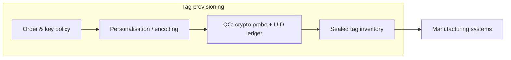

### 4.2 Manufacturing and commissioning

**Activities:**

- **Digital twin creation** per item or per aggregation policy.
- **Batch and serial association** to regulatory and commercial identifiers.
- **Parent–child aggregation:** item → inner pack → carton → pallet → shipment.

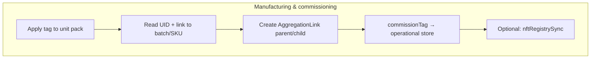

### 4.3 Distribution and logistics

**Activities:**

- **Scan events** at warehouse, inbound/outbound, port of entry, distributor, and key retail nodes.
- **De-aggregation / re-aggregation** with integrity checks when cases are split.
- **Real-time visibility:** SLA dashboards, cold-chain flags (if sensor data integrated), route dwell analytics.

**Operational detail:** Effective logistics capture is less about “more scans” than about **scanning at custody boundaries**—when risk or ownership changes. For imports, **port-of-entry** events paired with customs documentation references (where legally permissible) accelerate regulator confidence. For wholesale markets, **distributor attestation**—who received which aggregation ID—creates the graph edges required for later **diversion mathematics**. Exceptions (damaged cases, partial shipments) should be first-class workflows so that operators do not bypass the system informally.

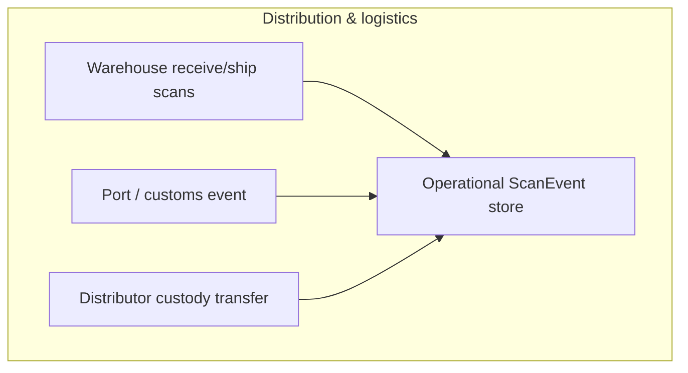

### 4.4 Retail and consumer verification

**Activities:**

- **Tap-to-verify** consumer journey with clear **genuine / suspicious / already verified** messaging.
- **QR and SMS/USSD** paths normalised to the same policy engine.
- **Engagement:** education, loyalty, and responsible reporting flows.

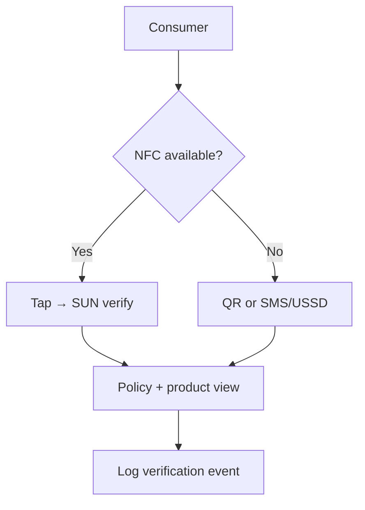

### 4.5 Regulatory and enforcement oversight

**Activities:**

- **Dashboards** for regulators (e.g., NAFDAC-style oversight): volumes, geography, repeat scans, anomaly queues.
- **Hotspot detection** and **counterfeit cluster** hypotheses (see Section 8 for AI augmentation).
- **Recall / quarantine:** BatchStatus transitions with stakeholder notifications per SOP.

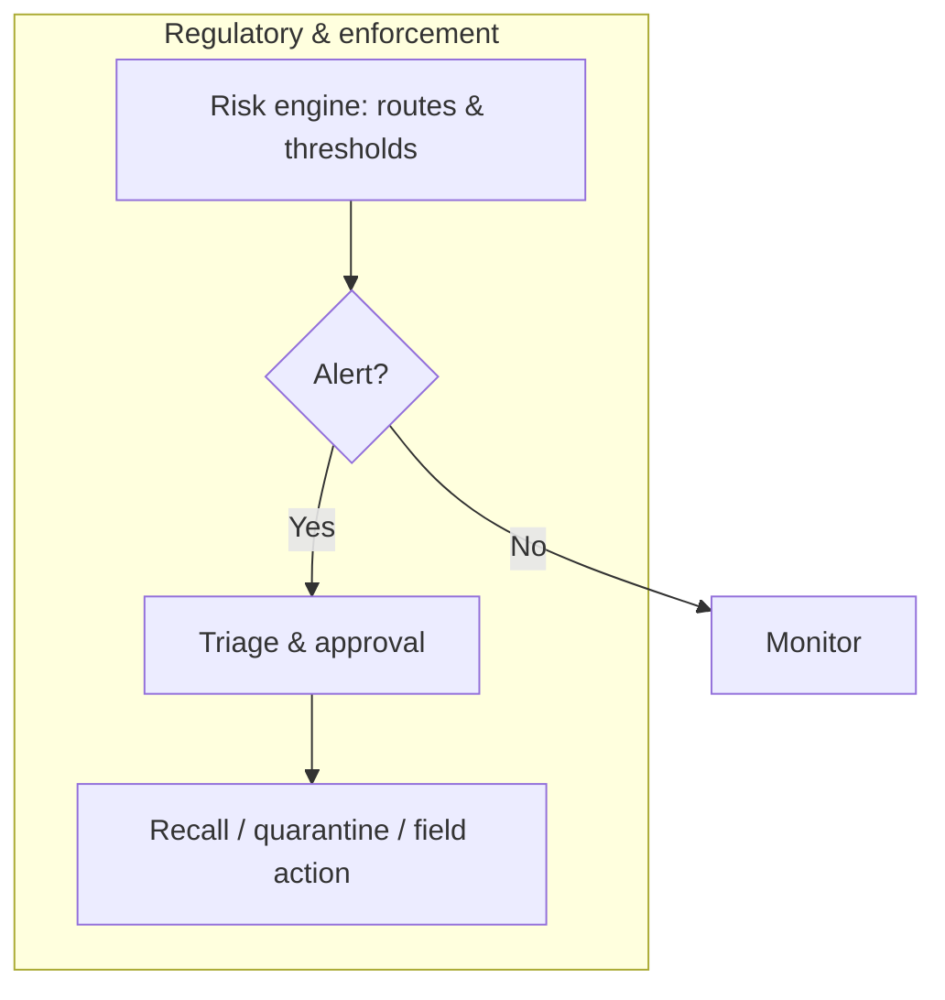

### 4.6 Consolidated lifecycle (reference)

The diagram below aligns conceptually with programme phases from configuration through field reporting (compare with `docs/diagrams/04-business-flow.mmd` in the TraceGuard reference implementation).

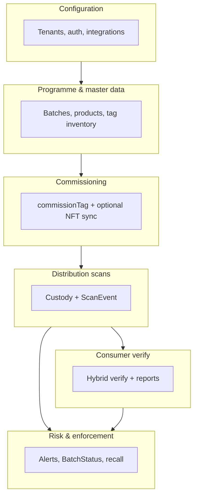

---

## 5. System Architecture

Truetrace adopts a **layered architecture** that keeps secrets and business rules **server-side**, while enabling **thin clients** and **integration portability**.

### 5.1 Layered view

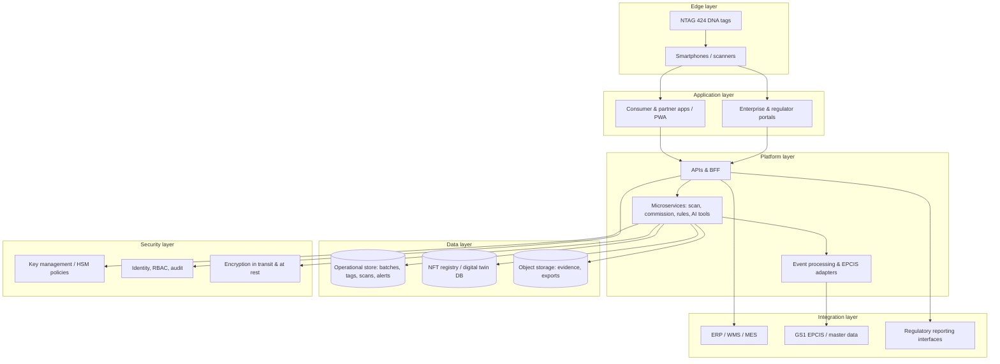

### 5.2 Layer notes

- **Edge layer:** Physical trust anchor begins at the tag; device attestation and anti-automation policies complement hardware strength.
- **Application layer:** Role-specific UX—consumers verify; partners scan; regulators analyse; manufacturers administer programmes.
- **Platform layer:** Named operations (e.g., scan, commission, dashboard aggregation) encapsulate **joins and privileged reads** that must not leak to untrusted clients.
- **Data layer:** **Operational store is canonical for field truth** (high-volume scans). **NFT registry** holds taxonomy, token lifecycle, and metadata revisions suitable for compliance history and optional on-chain alignment.
- **Integration layer:** EPCIS bridges, ERP shipments, and regulator exports reduce manual reconciliation.
- **Security layer:** Key diversification, rotation, breach processes, and **auditability** for AI-assisted decisions (see Section 8).

### 5.3 Deployment patterns

Enterprises may deploy Truetrace as **multi-tenant SaaS** (fastest time-to-value), **dedicated cloud** (policy-driven isolation), or **hybrid** (sensitive data on-premise with verification APIs in cloud). A **BFF (backend-for-frontend)** pattern shields mobile clients from evolving microservice topology. Event ingestion should be **idempotent** at the message boundary (tag UID + event type + timestamp + location hash) to survive retries in flaky networks—a practical requirement in warehouse and port environments.

### 5.4 Alignment with reference implementation (TraceGuard)

Organisations evaluating technical depth may map Truetrace’s logical layers to the **TraceGuard** reference architecture: a React/Vite client, a portable `lib/api` integration layer (`rest` or `supabase`), hosted backend contracts (`scanTag`, `commissionTag`, `getDashboardStats`, …), server-side functions, an **operational data store**, and an **optional PostgreSQL `nft_registry`** synchronised post-commissioning. Diagram sources: `docs/diagrams/01-architecture.mmd`, `02-operational-domain.mmd`, `03-nft-registry.mmd`, and `04-business-flow.mmd`.

---

## 6. Stakeholder Value Proposition

| Stakeholder | Primary benefits |
|--------------|------------------|
| **Manufacturers** | Brand protection; **precision recalls**; channel compliance; partner scorecards; export readiness (GS1). |
| **Regulators** | **Enforcement intelligence**; anomaly visibility; programme audit trails; scalable oversight vs manual complaints. |
| **Distributors / retailers** | **Channel integrity**; reduced liability from unknowing handling of fakes; simpler inbound checks. |
| **Consumers** | **Trust**; clarity; inclusive verification paths; responsible reporting. |
| **Investors** | **Recurring SaaS**; consumables (tags); data/analytics upsell; platform leverage across sectors and geographies. |

**Manufacturers (expanded):** Beyond deterrence, Truetrace converts authentication into **operational data**—which distributors actually scanned inbound, which regions over-index on verification anxiety, and which batches exhibit anomalous velocity. That data supports **contractual channel policy**, **inventory placement**, and **post-market surveillance** conversations with regulators. Export-oriented firms benefit when internal event semantics align with **EPCIS** expectations in destination markets, reducing duplicate IT projects.

**Regulators (expanded):** Traditional models rely heavily on complaints and seizures—necessary but lagging. Truetrace enables **proactive supervision**: heat maps of verification failures, repeat authentication attempts that may indicate cloning, and cohort views by NAFDAC registration number or equivalent. When linked to recall workflows, regulators can see **coverage** (how many units were likely reached by messaging) rather than inferring from press releases alone.

**Distributors and retailers (expanded):** For legitimate traders, fakes are both a **reputation risk** and a **margin destroyer**. Lightweight inbound scanning—NFC or handheld—creates an auditable **receipt record** that can defend good-faith possession during enforcement actions. Retailers can also integrate verification prompts into **loyalty** or **cashier** flows where appropriate.

**Consumers (expanded):** The primary ask is **speed and clarity**: a decisive answer, in local language, with guidance if something is wrong (return path, hotline, avoid consumption). Hybrid channels matter for **equity**—the same policy engine should drive outcomes whether the user taps, scans a QR, or uses USSD.

**Investors (expanded):** The platform exhibits **natural extensions**: each new vertical reuses verification cores while adding sector-specific dashboards and compliance packs. Marginal cost of software replication is favourable; the gating factors are **go-to-market** (regulatory credibility, SI partnerships) and **working capital** for tag supply chains during large rollouts.

**Stakeholder ecosystem map:**

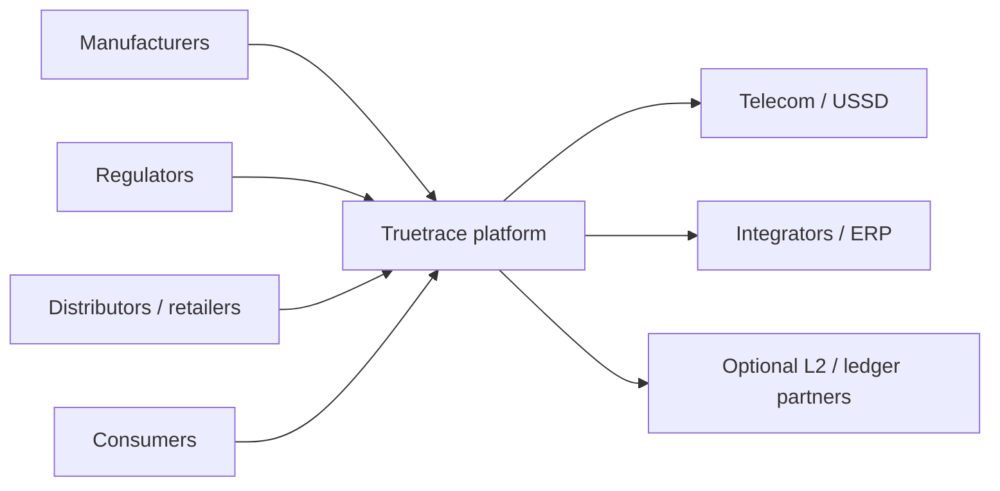

---

## 7. Comparison with Existing MAS / USSD Solutions

**MAS (illustrative baseline):** scratch PIN + SMS to short code + provider validation.

| Criterion | Typical MAS / USSD authentication | Truetrace (NFC + hybrid) |
|-----------|----------------------------------|---------------------------|
| **Accessibility** | High via SMS/USSD; ubiquitous | **High** when SMS/USSD retained; NFC adds friction on old phones |
| **Security** | PIN replay/theft/cloning of *packaging* remains a risk | **Higher** with secure NFC SUN + server policy; still requires operational discipline |
| **Traceability** | Limited to verification events | **End-to-end** event graph + custody model |
| **Data intelligence** | PIN lookup logs | **Route, geography, velocity, aggregation** analytics |
| **Consumer experience** | Scratch + type | **Tap-first**; QR; SMS fallback |
| **Regulatory integration** | Established pattern | **Extends** oversight dashboards, recalls, evidence |
| **Scalability** | SMS cost curves; provider-bound | **Cloud-native** event ingestion; multi-channel |

**Why “MAS 2.0”:** Truetrace **preserves the inclusion DNA** of national mobile authentication while upgrading to **item-level cryptographic identity**, **supply-chain trace evidence**, and **modern analytics**—without discarding SMS/USSD where they remain essential.

**Important nuance:** MAS and analogous programmes delivered **population-scale education** that should not be discarded. Truetrace’s positioning is additive: regulators can maintain **SMS short-code familiarity** while progressively introducing **tap-first** experiences on newer devices. From a procurement standpoint, multi-provider MAS ecosystems (approved service providers under NAFDAC’s framework) demonstrate that **regulated markets can sustain vendor pluralism**; Truetrace can interoperate with or complement such structures depending on national policy, rather than assuming a single monopoly operator.

**Table notes for decision-makers:** “Security” and “traceability” are not interchangeable—many systems are secure at the **message** layer but weak at the **supply-chain evidence** layer. Truetrace explicitly scores both. Likewise, **consumer experience** must be judged inclusive of **feature-phone** users, not only flagship smartphone owners.

---

## 8. AI Agent Integration

AI agents (including large language model–based assistants) should be deployed as **governed tools**, not silent decision-makers.

| Use case | Function | Guardrails |
|----------|----------|------------|
| **Anomaly detection** | Score unusual scan sequences, geographies, time windows | Human review queues; threshold tuning |
| **Predictive diversion** | Foreshadow channel leaks based on patterns | **Explainable features** (e.g., dwell, route mismatch) |
| **Compliance automation** | Draft regulator notices from templates; checklist enforcement | **Human approval**; immutable logs |
| **Conversational verification** | WhatsApp/SMS/voice bots guide users | Strict tool boundaries; escalation paths |
| **Decision support** | Summarise cases for inspectors | **Citation** to underlying events and documents |

**Auditability:** Each AI-assisted recommendation should store **inputs used**, **model/version**, and **confidence**, linked to the operational record for later scrutiny.

**Architecture pattern:** AI should interact with production data through **narrow tools** (e.g., “fetch scan timeline for tag X,” “list open alerts for batch Y”) rather than open SQL. This **tool-use** design limits hallucinated facts and supports later compliance review. For **conversational channels** (WhatsApp, SMS, voice IVR), the agent should distinguish **educational** content from **deterministic verification outcomes**—the latter must come from the same policy engine as NFC/QR, ensuring one source of truth.

**Human-in-the-loop:** Regulators and manufacturer compliance officers benefit from **draft narratives** (what happened, which partners touched the batch, what evidence exists) while retaining **approval authority** for enforcement actions. Manufacturers may use AI to **simulate** recall scenarios—coverage maps, estimated affected units—without executing workflows until authorised.

---

## 9. Revenue Model and Business Strategy

### 9.1 Monetisation streams

1. **Tags and hardware** — secure labels, inlays, readers for industrial nodes.  
2. **SaaS** — per-SKU, per-scan, or per-site subscriptions; tiered analytics.  
3. **Data & intelligence** — anonymised sector insights; enforcement dashboards.  
4. **Regulatory partnerships** — licensed oversight modules; co-funded pilots.  
5. **Professional services** — integration, validation, training, 24/7 operations.

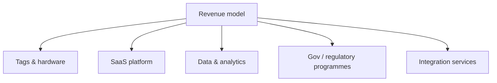

### 9.2 Strategy themes

- **Land with pilots** that prove signal value in 90–180 days.  
- **Expand via standards** (GS1, EPCIS) to unlock multinationals.  
- **Co-sell with telecom** for USSD reach and bundled airtime/data promotions where appropriate.

### 9.3 Pricing logic (illustrative)

Commercial constructs often combine: (1) **per-tag** or **per-million-units** hardware margin, (2) **platform fee** by programme tier, (3) **overage** on scans above contracted thresholds, and (4) **professional services** for ERP integration and validation. Regulatory programmes may prefer **capitated** annual licences with **performance SLAs** (uptime, support response, audit support). Investors should scrutinise **gross margin mix**: high hardware revenue without SaaS attach yields weaker lifetime value; conversely, SaaS-heavy models require **retention** through switching costs rooted in **integration depth** and **regulator reliance**.

---

## 10. Limitations and Gaps

- **Smartphone NFC penetration** is not universal; **QR/SMS** remain mandatory for equity of access.  
- **Regulatory accreditation** timelines can delay national programmes.  
- **Total cost of ownership** (tags + integration + change management) can challenge low-margin SKUs without **portfolio prioritisation**.  
- **Legacy ERP/WMS** variability increases integration lead time.  
- **Behaviour change** (partners actually scanning) is as critical as technology—requires incentives and audits.

**Additional honest constraints:**

- **Environmental and disposal:** Electronic tags and labelling change waste streams; enterprises should plan **recycling**, **materials declarations**, and **SKU-level** justification for secure inlays versus paper-only approaches.  
- **False positives and support load:** Aggressive anti-fraud rules can frustrate legitimate users (travel, connectivity glitches). Runbooks and **human support** capacity must scale with adoption.  
- **On-chain NFT hype vs utility:** Public blockchain linkage may be irrelevant or legally problematic for certain categories; the **business value** often resides in the **registry model** and audit trail, not public trading of tokens.  
- **Power asymmetry:** Smallest manufacturers may lack IT staff; without **managed services**, adoption could skew toward large incumbents unless consortium models emerge.

---

## 11. Recommendations

1. **Mandate hybrid NFC + QR + SMS/USSD** in all public programme designs.  
2. **Align formally with GS1** identifiers and EPCIS event semantics for enterprise adoption.  
3. **Structure pilots** with measurable KPIs: time-to-detect diversion, verification uptake, regulator case closure time.  
4. **Partner with telecoms and regulators** early for channel economics and legal clarity on consumer messaging.  
5. **Invest in education**—simple, localised messaging on *why* tap or scan matters.

**Additional operational recommendations:**

- **Publish a partner certification playbook** (scanning SOPs, device requirements, dispute resolution).  
- **Instrument incentives** for high-fidelity logistics events—recognition, rebates, or preferential allocation—so behaviour change is rational.  
- **Establish a vulnerability disclosure programme** for the verification domain (API abuse, social engineering of call centres).  
- **Pre-negotiate data-sharing agreements** between manufacturers and regulators clarifying **purpose limitation**, **retention**, and **cross-border** transfers where export manufacturing is involved.

---

## 12. Opportunities for Expansion

- **Cross-border trade** and customs pre-clearance evidence.  
- **Additional regulated sectors** (tobacco-style excise, chemicals, spare parts).  
- **Digital health** adjacencies (linkage to patient support where law permits).  
- **ESG**: proof of provenance, ethical sourcing, recycling chain-of-custody.  
- **Global scale** via multi-tenant SaaS and regional data residency.

---

## 13. Risk Assessment and Mitigation

| Risk category | Examples | Mitigation |
|---------------|----------|------------|
| **Technical** | Tag cloning attempts; API abuse | SUN verification; rate limits; device checks; monitoring |
| **Regulatory** | Data residency; consent | Local hosting options; DPIAs; clear consumer privacy notices |
| **Operational** | Partner non-compliance | Audits; incentives; exception reporting |
| **Financial** | SMS cost volatility | Hybrid routing; negotiated telecom tariffs |
| **Cybersecurity** | Credential theft; insider risk | RBAC, HSM policies, SIEM, pen testing |

### 13.1 Residual risk statement

No architecture eliminates counterfeit risk entirely; adversaries adapt. Truetrace raises **economic and technical cost** for attackers, improves **detection speed**, and improves **coordination** among legitimate actors. Boards should treat the programme as **risk reduction** with measurable KPIs, not absolute guarantees. Insurance and legal strategies (trademark enforcement, customs collaboration) remain necessary complements.

### 13.2 Incident response

A mature programme defines playbooks for: **tag cloning suspicions** (SUN anomalies), **database breach**, **provider outage** (telecom or cloud), and **mis-commissioning** (wrong batch linkage). Drills with regulators and manufacturers reduce real-event friction. Consumer communications during incidents must be **careful and consistent** to avoid panic or unjustified brand harm.

---

## 14. Implementation Roadmap

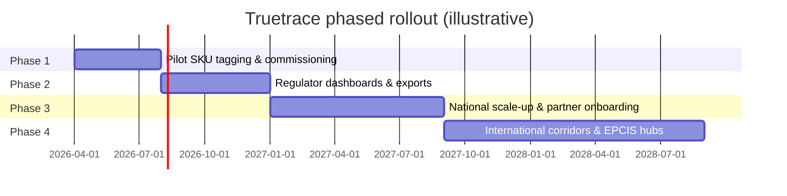

**Phase narrative:**

- **Phase 1 — Pilot:** Limited SKUs, factory integration, consumer UX hardening, baseline KPIs.  
- **Phase 2 — Regulatory integration:** Formal reporting, alert workflows, data contracts.  
- **Phase 3 — National scale-up:** Partner certification, SLA operations, telecom optimisation.  
- **Phase 4 — International:** Cross-border EPCIS, multi-language, ledger policy options.

---

## 15. Visuals and Diagrams

This report embeds Mermaid figures for:

- End-to-end lifecycle and subprocess flows (Section 4).  
- System architecture (Section 5).  
- Stakeholder ecosystem (Section 6).  
- Revenue model (Section 9).  
- Roadmap Gantt (Section 14).

For PNG/PDF exports suitable for board packs, render Mermaid to static assets or reference existing exports under `docs/diagrams/` (e.g., `01-architecture`, `04-business-flow`) from the TraceGuard documentation set.

**Value chain illustration:**

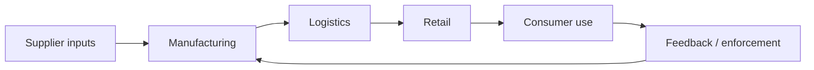

---

## 16. Conclusion

Truetrace NFT positions **secure NFC identity**, **standards-aligned traceability**, and **inclusive verification** as a single, regulator-grade capability. It respects what mobile authentication programmes already achieved in public literacy—while addressing the structural limits of **static codes** and **one-dimensional** authenticity checks.

For **policymakers**, Truetrace offers scalable oversight with **evidence discipline**. For **manufacturers and investors**, it offers a **platform-shaped** growth path across pharma, FMCG, agro-inputs, and adjacent regulated categories. For **society**, the objective is simple: **fewer harmful products in legitimate commerce**, faster recalls when things go wrong, and **higher trust** in the items people depend on every day.

**Strategic closing:** Nations that industrialise trust infrastructure early—payments, identity, now **product identity**—tend to attract higher-quality investment and reduce the hidden tax of informality. Truetrace is not merely an anti-counterfeit feature; it is a **coordination layer** among manufacturers, logistics partners, retailers, regulators, and consumers. Its success will be measured not only in software adoption but in **measurable reductions** in patient risk, brand leakage, and enforcement cycle times. With disciplined execution, transparent AI governance, and standards-first integration, Truetrace can become a **reference architecture** for how Africa’s supply chains prove authenticity without excluding the citizens who still reach for USSD first.

---

**Disclaimer:** Market figures are indicative and should be validated by independent diligence. Cryptographic features depend on correct implementation, key governance, and ongoing security operations. Blockchain/NFT components should be adopted only where they add clear legal and operational value.

**Document control:** Prepared for strategic discussion; not a binding offer or regulatory submission.
